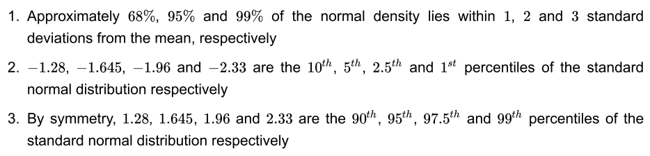

## Variability

- Standard normals have a variance of 1; means of n standard normals have standard deviation $1/\sqrt{n}$

R code below for demonstration:

```{r}
nosim <- 1000
n <- 10
sd(apply(matrix(rnorm(nosim * n), nosim), 1, mean))
1/sqrt(n)
```

- Standard uniforms have variance $1/12$; means of random samples of $n$ uniforms have sd $\frac{1}{\sqrt(12 \times n)}$

R code below for demonstration:

```{r}
nosim <- 1000
n <- 10
sd(apply(matrix(runif(nosim * n), nosim), 1, mean))

1/sqrt(12 * n)
```

- Poisson(4) have variance 4; means of random samples of $n$ Poisson(4) have sd $\frac{2}{\sqrt{n}}$

R code below for demonstration:

```{r}
nosim <- 1000
n <- 10
sd(apply(matrix(rpois(nosim * n, 4), nosim), 1, mean))
2 / sqrt(n)
```

- Fair coin flips have variance 0.25; means of random samples of $n$ coin flips have sd $\frac{1}{2\sqrt{n}}$

R code below for demonstration:

```{r}
nosim <- 1000
n <- 10
sd(apply(matrix(sample(0 : 1, nosim * n, replace = TRUE), nosim), 1, mean))
1 / (2 * sqrt(n))
```

- Data example

```{r, echo=TRUE, message=FALSE}
library(UsingR); data(father.son); 
x <- father.son$sheight
n <-length(x)
hist(x, breaks = 20, prob = TRUE, col = "lightblue", main = "Plot of the son's height", 
     ylab = "density", xlab = "sheight")
lines(density(x), col="blue", lwd=2)
round(c(var(x), var(x) / n, sd(x), sd(x) / sqrt(n)),2)
```
- Variance of X: var(x) = **7.92** (in sq inches)
- Standard deviation of X: sd(x) = **2.81** (in inches)
- Variablility in the average of 10 childrens heights: var(x)/n = **0.01**
- Variablility in the average of 10 childrens heights: sd(x)/sqrt(n) = **0.09** (standard error estimate)

## Distributions

### Bernoulli distribution

PMF $P(X =x) = p^x(1 - p)^{1 - x}$

The mean of a Bernoulli random variable is $p$ and the variance is $p(1 - p)$

It is typical to call $X = 1$ as a "success" and $X = 0$ as a "failure"

### Binomial distribution

- The binomial random variables are obtained as the sum of iid (independed identically distributed) Bernoulli trials $X = \sum_{i=1}^{n}{X_i}$
 
 Binomial mass function: $P(X = x) = \binom{n}{x}p^x(1-p)^{n-x}$
 
 $\binom{n}{x} = \frac{n!}{x!(n-x)!}$ and $\binom{n}{0} = \binom{n}{n} = 1$
 
 - Suppose a friend has 8 children 7 of which are girls and none are twins
 - If each gener has an independent 50% probability for each birth, what is the probability of
 getting 7 or more girls out of 8 births?
 
 $\binom{8}{7}.5^7(1-.5)^1+\binom{8}{8}.5^8(1-.5)^0\approx 0.04$
 
```{r}
choose(8, 7) * 0.5^8 + choose(8, 8) * 0.5^8
pbinom(6, size = 8, prob = 0.5, lower.tail = FALSE)
```
 
### Normal distribution

A distribution is **normal**/**Gaussian** with a mean $\mu$ and a 
variance $\sigma^2$ if the variable density is $(2\pi\sigma^2)^{-\frac{1}{2}}e^{\frac{{(-x-\mu)^2}}{2\sigma^2}}$

If X is a random varabile this the density above then $E[X] = \mu$ and $Var(X) = \sigma^2$ written $X \sim N(\mu,\sigma^2)$

For the standard normal distribution $\mu = 0$ and $\sigma = 1$.

Within -1 and 1 standard deviation area = 68%

Within -2 and 2 standard deviations area = 95% with 2.5% in either tail (confidence levels)

Within -3 and 3 = 99%

The 10% and 90% quantiles in a standard normal distribution are at -1.28 and +1.28. For a non-standard normal they are at $\mu -1.28*\sigma$ and $\mu + 1.28 * \sigma$



In R you can use **qnorm()** example: *qnorm(.95, mean = mu, sd = sd)* or for a standard normal  $\mu + \sigma*1.645$

What is the probability that a $N(\mu,\sigma^2)$ random variable is larger than $x$? You could estimate how many standard deviations $x$ is from the mean by using:
$\frac{X-\mu}{\sigma}$ 

Example from the slides:

Assume that the number of daily ad clicks for a company is approximately normally distributed with a mean of 1020 and a standard deviation of 50. 
What is the probability of getting more than 1,160 clicks in a day?  It is not very likely since 1,160 is 2.8 standard deviation from the mean.

```{r}
pnorm(1160, mean = 1020, sd = 50, lower.tail = FALSE)
pnorm(2.8, lower.tail = FALSE)
```

Second example from the slides:

Assume that the number of daily ad clicks for a company is approximately normally distributed with a mean of 1020 and a standard deivation of 50.
What number of daily ad clicks would represent the one where 75% of days have fewer clicks (assuming days are independent and identically distributed)?

```{r}
qnorm(0.75, mean = 1020, sd = 50)
```

### Poisson distribution

This distribution is used to model counts.

The mass function is : $P(X=x;\lambda) = \frac{\lambda^xe^{-\lambda}}{x!}$ for $x = 0,1,...$

The mean is $\lambda$

The variance is $\lambda$

$x$ ranges from $0$ to $\infty$

Used for:

- Modeling count data
- Modeling event-time or survival data
- Modeling contingency tables
- Approximating binomials when $n$ is large and $p$ is small

Used to model rates:

$X \sim Poisson(\lambda t)$ where $\lambda = E[\frac{X}{t}]$ is the expected count per unit of time and $t$ is the total monitoring time.

Example of modeling rates:

The number of people that show up at a bus stop is Poisson with a mean of 2.5 per hour.

If watching the bus stop for 4 hours, what is the probability that 3 or fewer people show up for the whole time?

```{r}
ppois(3, lambda = 2.5 * 4)
```

Example of modeling a binomial when $n$ is large and $p$ is small:

- $X \sim Binomial(n,p)$
- $\lambda = np$
- $n$ gets large
- $p$ gets small

We flip a coin with success probability of 0.01 five hundred times.

What is the probability of 2 or fewer successes?

```{r}
pbinom(2, size = 500, prob = 0.01)
ppois(2, lambda = 500 * 0.01)
```

## Asymptotics

Asymptotics is the term for the behavior of statistics as the sample size (or some other relevant quantity) limits to infinity (or some other relevant number)

### The law of large numbers

- The average limits to what it is estimating, the population mean

```{r}
n <- 10000
means <- cumsum(rnorm(n))/(1:n)
library(ggplot2)
g <- ggplot(data.frame(x = 1:n, y = means), aes(x = x, y = y))
g <- g + geom_hline(yintercept = 0) + geom_line(color = "blue",size = 1.5)
g <- g + labs(x = "Number of obs", y = "Cumulative mean")
g
rm(list=ls(all=TRUE))
```

Coin flip example:

```{r}
n <- 10000
means <- cumsum(sample(0:1, n, replace = TRUE))/(1:n)
g <- ggplot(data.frame(x = 1:n, y = means), aes(x = x, y = y))
g <- g + geom_hline(yintercept = 0.5) + geom_line(color = "darkgreen", size = 1.5)
g <- g + labs(x = "Number of obs", y = "Cumulative mean")
g
rm(list=ls(all=TRUE))
```

An estimator is **consistent** if it converges to what you want to estimate.

The Law of Large Numbers says that the sample mean of an **iid** sample (independent and identically distributed) is consistent for the population mean. The sample standard deviation  and variance of **iid** randoms variables are also consistent.

### Central Limit Theorem

- One of the most important theorems in statistics
- States that the distribution of averages of **iid** variables (properly normalized) becomes that of a standard normal as the sample size increases
- $$\frac{\bar{X_n}-\mu}{\frac{\sigma}{\sqrt{n}}} = \frac{\sqrt{n}(\bar{X_n}-\mu)}{\sigma}=\frac{\text{Estimate} - \text{Mean of estimate}}{\text{Std. Err. of estimate}}$$ has a distribution like that of a standard normal for large $n$.
- $\bar{X_n}$ is approximately $N(\mu,\frac{\sigma^2}{n})$

### Confidence intervals

$\bar{X}$ is approximately normal with mean $\mu$ and sd $\frac{\sigma}{\sqrt{n}}$. The probability that $\bar{X}$ is bigger than $\mu + \frac{2\sigma}{\sqrt{n}}$ or smaller than $\mu - \frac{2\sigma}{\sqrt{n}}$ is 5%. $\bar{X}\pm\frac{2\sigma}{\sqrt{n}}$ is called a 95% interval for $\mu$.

Confidence interval for the average height of sons:

```{r}
library(UsingR)
data(father.son)
x <- father.son$sheight
(mean(x) + c(-1, 1) * qnorm(0.975) * sd(x)/sqrt(length(x)))/12
```

#### Wald confidence interval (Sample proportions)

Replace $p$ with $\hat{p}$ in the standard error.

For 95% intervals $\hat{p}\pm\frac{1}{\sqrt{n}}$ is a quick CI estimate for $p$

Example:

In a random sample of 100 likely voters, 56 intend to vote for  you. Can you relax?

Using the Wald confidence interval:

$\frac{1}{\sqrt{100}} = 0.1$ so $\hat{p}\pm0.1 = 56 \pm 0.1 = (0.46, 0.66)$ for the 95% confidence interval.
Keep campaigning!

Rough guidelines: 100 for 1 decimal place, 10,000 for 2, 1,000,000 for 3.

Binomial interval for the same problem, first manually then using **binom**:

```{r}
0.56 + c(-1, 1) * qnorm(0.975) * sqrt(0.56 * 0.44/100)
binom.test(56, 100)$conf.int
```

Simulation:

Flip a coin and calcualte the percentage of time the Wald interval covers the true coin probability used to generate the data.

```{r}
# Twenty coin flips in each simulation 
n <- 20 
# True values varied between 0.1 and 0.9 step through by 0.05
pvals <- seq(0.1, 0.9, by = 0.05) 
# 1000 simulations
nosim <- 1000 

# Loop through and for each true success probability
coverage <- sapply(pvals, function(p) {
  # Generate a 1000 sets of 10 coin flips and take the
  # sample proporation
  phats <- rbinom(nosim, prob = p, size = n)/n
  # Calculate lower limit
  ll <- phats - qnorm(0.975) * sqrt(phats * (1 - phats)/n)
  # Calculate uppper limit
  ul <- phats + qnorm(0.975) * sqrt(phats * (1 - phats)/n)
  # Calculate the proportion of time the cover the true value
  # of p that was used to simulate the data
  mean(ll < p & ul > p)
})
df <- data.frame(coverage,pvals)
ggplot(data = df, aes(x=pvals, y=coverage)) + geom_line(color = "blue", size=1.5) + 
    geom_hline(yintercept = 0.95, color="darkgreen", size = 1.5)
```

Better than 95% for 0.5, but it is very far off for smaller/larger values of $n$. In the case above $n$ isn't
large enough for the CLT to be applicable for many of the values of $p$.

Quick fix (Agresti/Coull interval) form the interval as: $\frac{X+2}{n+4}$ adding two successes and failures.

First show how the CLT improves with larger values of $n$.

```{r}
# Twenty coin flips in each simulation 
n <- 10000
# True values varied between 0.1 and 0.9 step through by 0.05
pvals <- seq(0.1, 0.9, by = 0.05) 
# 1000 simulations
nosim <- 1000 

# Loop through and for each true success probability
coverage <- sapply(pvals, function(p) {
  # Generate a 1000 sets of 10 coin flips and take the
  # sample proporation
  phats <- rbinom(nosim, prob = p, size = n)/n
  # Calculate lower limit
  ll <- phats - qnorm(0.975) * sqrt(phats * (1 - phats)/n)
  # Calculate uppper limit
  ul <- phats + qnorm(0.975) * sqrt(phats * (1 - phats)/n)
  # Calculate the proportion of time the cover the true value
  # of p that was used to simulate the data
  mean(ll < p & ul > p)
})
df <- data.frame(coverage,pvals)
ggplot(data = df, aes(x=pvals, y=coverage)) + geom_line(color = "blue", size=1.5) + 
    geom_hline(yintercept = 0.95, color="darkgreen", size = 1.5)
```

Now try the Agresti/Coull interval on the $n=20$ simulation by adding two successes and two failures.

```{r}
# Twenty coin flips in each simulation 
n <- 20 
# True values varied between 0.1 and 0.9 step through by 0.05
pvals <- seq(0.1, 0.9, by = 0.05) 
# 1000 simulations
nosim <- 1000 

# Loop through and for each true success probability
coverage <- sapply(pvals, function(p) {
  # Generate a 1000 sets of 10 coin flips and take the
  # sample proporation
  phats <- (rbinom(nosim, prob = p, size = n) + 2)/(n + 4)
  # Calculate lower limit
  ll <- phats - qnorm(0.975) * sqrt(phats * (1 - phats)/n)
  # Calculate uppper limit
  ul <- phats + qnorm(0.975) * sqrt(phats * (1 - phats)/n)
  # Calculate the proportion of time the cover the true value
  # of p that was used to simulate the data
  mean(ll < p & ul > p)
})
df <- data.frame(coverage,pvals)
ggplot(data = df, aes(x=pvals, y=coverage)) + geom_line(color = "blue", size=1.5) + 
    geom_hline(yintercept = 0.95, color="darkgreen", size = 1.5)
```

In general the add 2 successes and 2 failures should be used for small values of $n$ rather than the Wald interval.

#### Poisson interval

A nuclear pump failed 5 times of of 94.32 days, give a 95% confidence interfal for the failure rate per day?

- $X \sim Poisson(\lambda t)$
- Estimate $\hat{\lambda} = \frac{X}{t}$
- $Var(\hat{\lambda}) = \frac{\lambda}{t}$
- $\frac{\hat{\lambda}}{t}$ is the variance estimate

Note: Failure rate is $\lambda$ and number of days is $t$

R code for the calculation:

```{r}
# Number of events
x <- 5
# Monitoring time
t <- 94.32
# Estimate of the rate
lambda <- x/t
# Confidence interval estimate
round(lambda + c(-1, 1) * qnorm(0.975) * sqrt(lambda/t), 3)

# Exact interval (could be wider than desired)
poisson.test(x, T = 94.32)$conf
```


Simulation of the coverage rate using Poisson:
    
```{r}
lambdavals <- seq(0.005, 0.1, by = 0.01)
nosim <- 1000
t <- 100
coverage <- sapply(lambdavals, function(lambda) {
 lhats <- rpois(nosim, lambda = lambda * t)/t
 ll <- lhats - qnorm(0.975) * sqrt(lhats/t)
 ul <- lhats + qnorm(0.975) * sqrt(lhats/t)
 mean(ll < lambda & ul > lambda)
})

df <- data.frame(coverage,lambdavals)
ggplot(data = df, aes(x=lambdavals, y=coverage)) + geom_line(color = "blue", size=1.5) + 
    geom_hline(yintercept = 0.95, color="darkgreen", size = 1.5)
```

The result is really bad for small values of lambda.

Next increase $t$ to 1000:

```{r}
lambdavals <- seq(0.005, 0.1, by = 0.01)
nosim <- 1000
t <- 1000
coverage <- sapply(lambdavals, function(lambda) {
 lhats <- rpois(nosim, lambda = lambda * t)/t
 ll <- lhats - qnorm(0.975) * sqrt(lhats/t)
 ul <- lhats + qnorm(0.975) * sqrt(lhats/t)
 mean(ll < lambda & ul > lambda)
})

df <- data.frame(coverage,lambdavals)
ggplot(data = df, aes(x=lambdavals, y=coverage)) + geom_line(color = "blue", size=1.5) + 
    geom_hline(yintercept = 0.95, color="darkgreen", size = 1.5)
```

### Summary

- The **LLN** (Law of Large Numbers) states that averages of **iid** (Independent Identically Distributed) samples converge to the population means that they are estimating.
- The **CLT** (Central Limit Theorem) states that averages are approximately normal, with distributions
    - centered at the population mean
    - with standard deviation equal to the standard error of the mean
    - CLT gives no guarentee that $n$ is large enough
- Taking the mean and adding and subtracting the relevant normal quantile times the **SE** (Standard Error) yields a confidence interval for the mean
    - Adding and subtracting 2 SEs works for 95% intervals
- Confidence intervals get wider as the coverage increases
- Confidence intervals get narrower with less variability or larege sample sizes
- The Poisson and binomial case have exact intervals that don't reqire the CLT
    - But a quick fix for small sample size binomial calculation is to add 2 successes and failures

### Appendix

- mu $\mu$ is the mean
- sigma $\sigma$ is the standard deviation
- lambda $\lambda$ is the $E[\frac{X}{t}]$
- standard error of the sample means is the square root of its vairance
- variance of a sample mean is $\sigma^2/n$ esitmated with $s^2/n$
- $s/\sqrt{n}$ standard error
- ```rnorm(n,mean,sd)``` generates n independent random normal samples with the specified mean and sd. Defaults are mean 0 and sd 1.
- ```sd(apply(matrix(rnorm(10000),1000),1,mean))``` returns the standard deviation of 1000 averages each of a sample of 10 random normals
- $2/\sqrt{n}$ is the sd of  n Poisson(4)
- Averages of 10 Poisson(4) samples sd = 2/sqrt(10) 
- ```sd(apply(matrix(rpois(10000,4),1000),1,mean))``` to check the above

## Quiz

1. What is the variance of the distribution of the average an IID draw of n observations from a population with mean $\mu$ and variance $\sigma^2$?

Ans: $\frac{\sigma^2}{n}$

2. Suppose that diastolic blood pressures (DBPs) from men aged 35-44 are normally distributed with a mean of 80mmHg and a standard deviation of 10 mmHg. About what is the probability that a random 35-44 year old has a DBP less than 70 ?

Ans: 
```{r}
pnorm(70, mean = 80, sd = 10)
``` 

3. Brain volume for adult women is normally distributed with a mean of about 1,100 cc for women with a standard deviation of 75 cc. What brain volume represents the 95th percentile?

Ans:
```{r}
qnorm(0.95, mean = 1100, sd = 75)
```

4. Refer to the previous question. Brain volume for adult women is about 1,100 cc for women with a standard deviation of 75 cc. Consider the sample mean of 100 random adult women from this population. What is the 95th percentile of the distribution of that sample mean?

Ans:
```{r}
qnorm(0.95, mean = 1100, sd = 75/sqrt(100))
```

5. You flip a fair coin 5 times, about what's the probability of getting 4 or 5 heads?

Ans:
```{r}
# 3 for q since we want 4 or 5 heads, 5 flips, probability 0.5
pbinom(3, size = 5, prob = 0.5, lower.tail = FALSE)
```

6. The respiratory disturbance index (RDI), a measure of sleep disturbance, for a specific population has a mean of 15 (sleep events per hour) and a standard deviation of 10. They are not normally distributed. Give your best estimate of the probability that a sample mean RDI of 100 people is between 14 and 16 events per hour?

Ans:
```{r}
# Use pnorm, even tho the distribution isn't normal. Subtraction the probabilty of 
# the result begin at 1 sd from 14 from the probability of it being 1 sd from 16
# should give the probability of it being between 14-16 given the mean is 15.
pnorm(16, mean = 15, sd = 1) - pnorm(14, mean = 15, sd = 1)
```

7. Consider a standard uniform density. The mean for this density is .5 and the variance is 1 / 12. You sample 1,000 observations from this distribution and take the sample mean, what value would you expect it to be near?

Ans:
```{r}
mean(rnorm(1000, mean = 0.5, sd = sqrt(1/12)))
```

8. The number of people showing up at a bus stop is assumed to be Poisson with a mean of 5 people per hour. You watch the bus stop for 3 hours. About what's the probability of viewing 10 or fewer people?

Ans:
```{r}
ppois(10, lambda = 5 * 3)
```